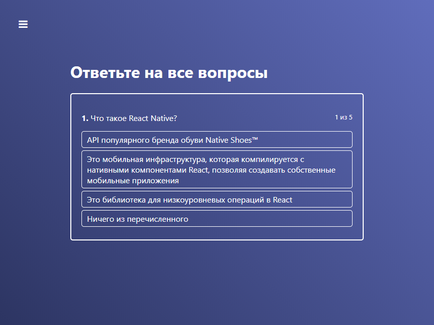
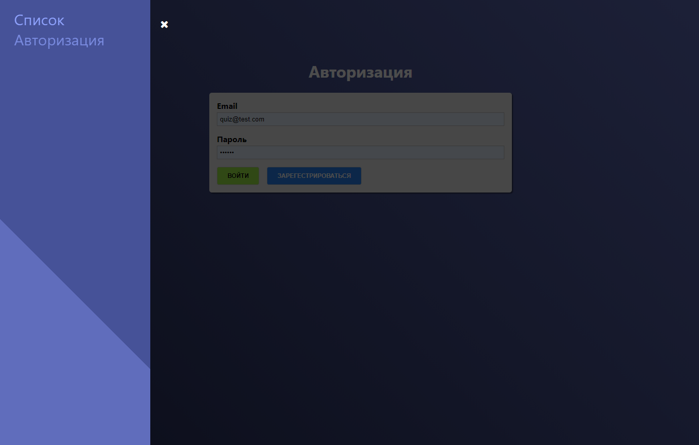
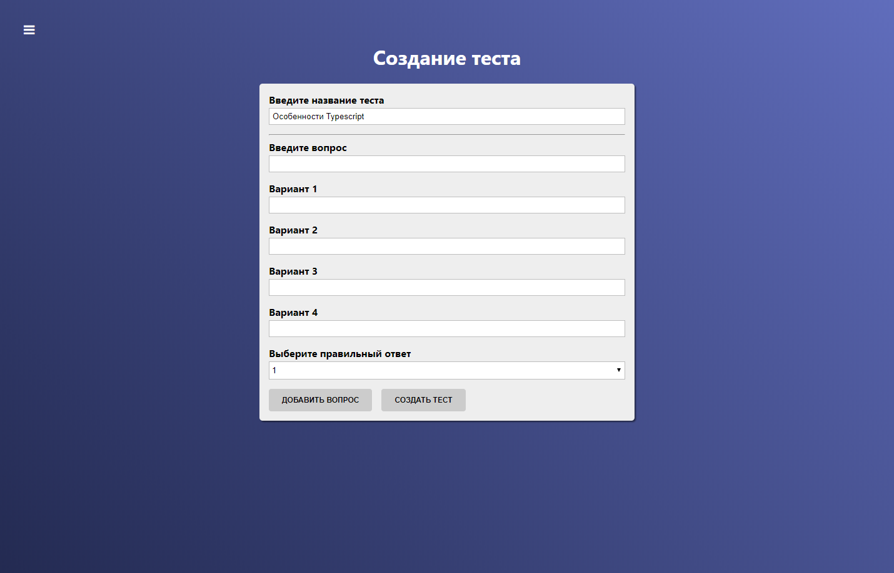

# Проект «Тесты на React»

Сервис, на котором можно пройти тесты, оставленные зарегестрированными пользователями, а также сомому создать тесты после регистрации.

Перейти можно по <a ref="https://react-quiz-c9f11.firebaseapp.com/">ссылке</a>

Что включено в проект:
<ul>
<li>Подключение к API Firebase, авторизация и работа с базой данных.</li>
<li>Middleware, aсинхронное изменение состояния с помощью Redux Thunk</li>
<li>Роутинг с помощью React Router</li>
<li>Динамическая валидация форм с PropTypes</li>
<li>A также использование сервисов <a ref="https://loading.io">https://loading.io</a>, axios.js</li>
</ul> 

